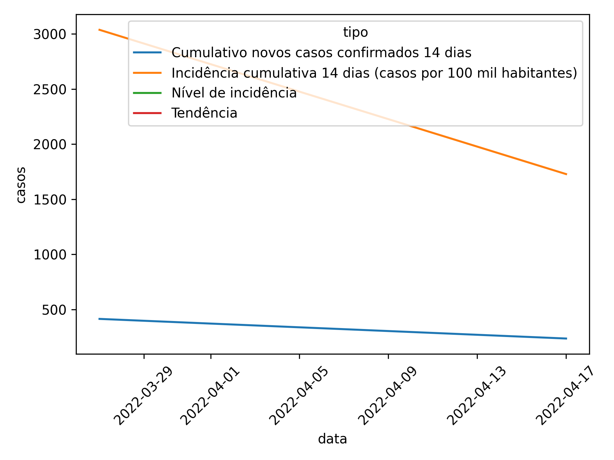

## graph

##Last 15 data points.

| data       |   Novos casos confirmados (n.º) |   Casos ativos (n.º) |   Cumulativo novos casos confirmados 14 dias |   Incidência cumulativa 14 dias (casos por 100 mil habitantes) |   Óbitos (n.º) |   Vigilâncias ativas (n.º) |
|:-----------|--------------------------------:|---------------------:|---------------------------------------------:|---------------------------------------------------------------:|---------------:|---------------------------:|
| 25-01-2022 |                             152 |                  nan |                                          626 |                                                           4567 |             11 |                        nan |
| 27-01-2022 |                             174 |                  nan |                                          731 |                                                           5333 |             11 |                        nan |
| 31-01-2022 |                             289 |                  nan |                                          860 |                                                           6274 |             11 |                        nan |
| 03-02-2022 |                             152 |                  nan |                                          883 |                                                           6442 |             11 |                        nan |
| 04-02-2022 |                              68 |                  nan |                                          856 |                                                           6260 |             11 |                        nan |
| 07-02-2022 |                             118 |                  nan |                                          858 |                                                           6260 |             13 |                        nan |
| 08-02-2022 |                              32 |                  nan |                                          823 |                                                           6004 |             13 |                        nan |
| 09-02-2022 |                              60 |                  nan |                                          747 |                                                           5450 |             13 |                        nan |
| 10-02-2022 |                              49 |                  nan |                                          719 |                                                           5245 |             13 |                        nan |
| 14-02-2022 |                              70 |                  nan |                                          696 |                                                           5078 |             13 |                        nan |
| 16-02-2022 |                              58 |                  nan |                                          537 |                                                           3918 |             14 |                        nan |
| 23-02-2022 |                              72 |                  nan |                                          329 |                                                           2400 |             14 |                        nan |
| 01-03-2022 |                             103 |                  nan |                                          212 |                                                           1547 |             14 |                        nan |
| 03-03-2022 |                              47 |                  nan |                                          202 |                                                           1474 |             14 |                        nan |
| 07-03-2022 |                             138 |                  nan |                                          302 |                                                           2203 |             14 |                        nan |